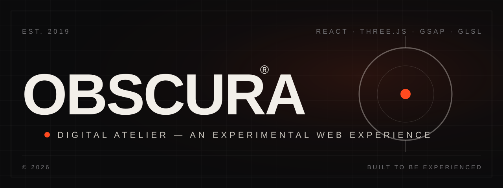
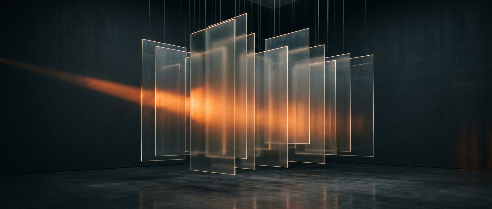
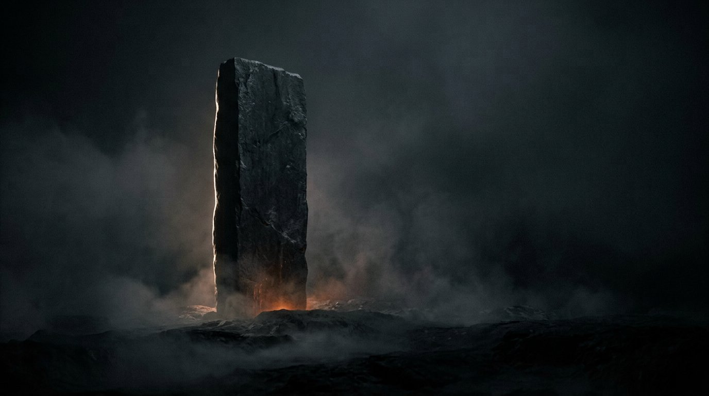
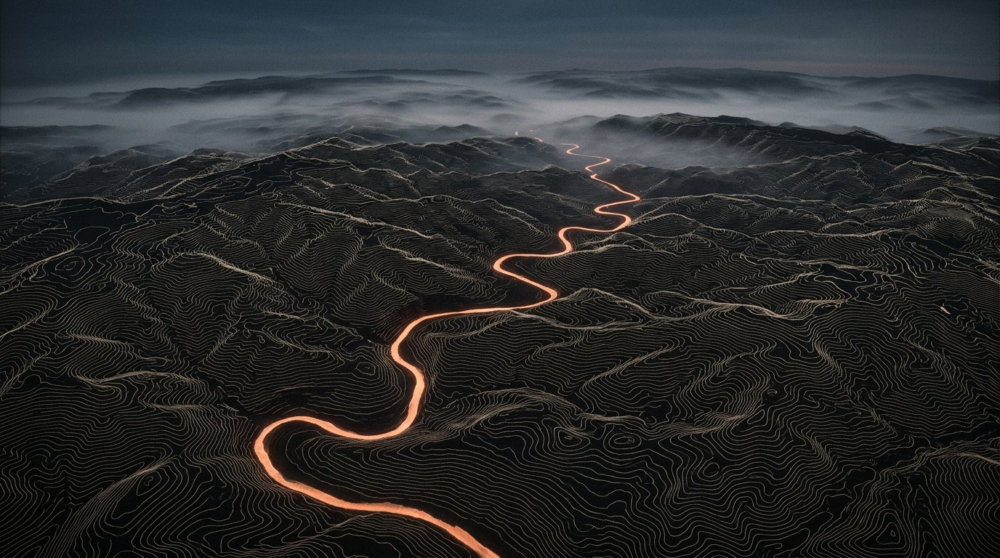
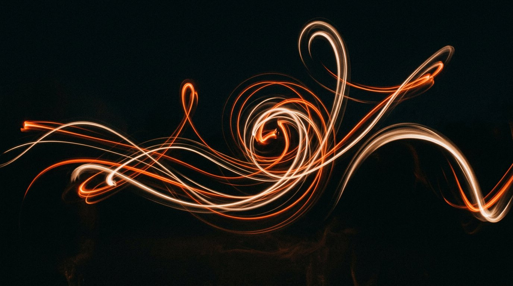

<p align="center">
  
</p>

<p align="center">
  <strong>An experimental digital atelier — an award-grade web experience where typography, motion and space become one material.</strong>
</p>

<p align="center">
  <a href="https://github.com/abhay0069/2nd3d-website/actions/workflows/ci.yml"></a>
  
  
  
  
  
  
</p>

---

## Table of contents

- [About](#about)
- [The experience](#the-experience)
- [Art direction](#art-direction)
- [Tech stack](#tech-stack)
- [Quick start](#quick-start)
- [Scripts](#scripts)
- [Project structure](#project-structure)
- [The hero sandwich](#the-hero-sandwich)
- [Motion language](#motion-language)
- [Performance](#performance)
- [Accessibility](#accessibility)
- [Browser support](#browser-support)
- [Documentation](#documentation)
- [Roadmap](#roadmap)
- [Contributing](#contributing)
- [License](#license)
- [Acknowledgements](#acknowledgements)

---

## About

**OBSCURA** is a fictional digital atelier built as a fully original, self-contained web experience —
equal parts experimental studio website, interactive art piece and high-end WebGL experiment.

It is **not** a template, not a SaaS landing page and not a portfolio grid. Every section has its
own composition; every interaction has its own grammar. The goal is the question every visitor
should ask: *“How was this website made?”*

> **Originality note** — the identity, copywriting, layouts, shaders and interaction systems are
> original work. This project is inspired only by the *level of craft* of leading digital studios;
> no code, branding, text, layouts or assets from any existing website are used.

## The experience

| # | Section | What happens |
|---|---------|--------------|
| — | **Opening sequence** | Dark room, clipped `A DIGITAL / EXPERIENCE` title, `INITIALIZING` counter to `100`, five-column wipe into the site. |
| 01 | **Hero** | `WE SCULPT / DIGITAL / MATTER` at viewport scale — with a morphing WebGL sculpture woven *through* the letters. Camera dollies as you scroll; the headline shears apart. |
| 02 | **Manifesto** | Words brighten progressively while scrolling (scrubbed reading), typography skews with scroll velocity. |
| — | **Marquee** | Editorial strip that leans into the direction of travel. |
| 03 | **Capabilities** | A paper band that expands from a card into the full viewport; hover a row and a visual preview follows your cursor. |
| 04 | **Work** | Vertical scroll pins the section and travels *horizontally* through four projects with counter-parallax imagery — one panel carries a live 3D preview. Click for a curtain-style case reveal. |
| 05 | **Lab** | Four live instruments: particle field, type tension, raw-WebGL liquid flux, fading gesture trace. |
| 06 | **Contact** | `LET'S MAKE SOMETHING UNEXPECTED.` — magnetic email, socials, live Berlin clock. |
| — | **Footer** | `BUILT TO BE EXPERIENCED.` and an outline wordmark bleeding off the baseline. |

Plus the chrome that ties it together: a custom cursor that morphs into labelled discs,
navigation that hides and returns with an ember progress hairline, film grain over everything,
and an optional procedural ambient drone (`SOUND ON / OFF` — **never** autoplayed).

## Art direction

A restrained system: deep black, warm white, graphite, and **one** ember accent (`#FF4A1F`)
used sparingly. No neon, no rainbow gradients — the sophistication comes from composition,
typography, scale, timing and depth.

<p align="center">
  
  
  
  
</p>

<p align="center"><sub>Generated art-direction visuals used in the experience — one consistent palette across all imagery.</sub></p>

## Tech stack

| Layer | Choice |
|-------|--------|
| App | **React 18 + TypeScript + Vite 5** |
| 3D | **Three.js r169 + React Three Fiber + Drei** — custom GLSL materials, procedural geometry, GPU particles |
| Post | **@react-three/postprocessing** — restrained bloom, vignette, grain |
| Motion | **GSAP + ScrollTrigger** — pinned horizontal rig, scrubbed typography, velocity effects |
| Smooth scroll | **Lenis** — driven by the GSAP ticker (one rAF for everything) |
| Overlays | **Framer Motion** — curtain transitions |
| Sound | **WebAudio** — procedural drone, no audio assets |
| Styling | CSS custom-property design tokens + per-module stylesheets |

## Quick start

```bash
# 1. clone
git clone https://github.com/abhay0069/2nd3d-website.git
cd 2nd3d-website

# 2. install (Node.js ≥ 18)
npm install

# 3. run
npm run dev          # → http://localhost:5173

# optional configuration
cp .env.example .env
```

Production build:

```bash
npm run build        # typecheck + bundle → dist/
npm run preview      # serve the production build
```

## Scripts

| Script | Purpose |
|--------|---------|
| `npm run dev` | Start the Vite dev server with HMR |
| `npm run build` | Type-check then produce the production bundle |
| `npm run preview` | Serve `dist/` locally |
| `npm run typecheck` | TypeScript only (`tsc --noEmit`) |

## Project structure

```
src/
├── animations/        GSAP choreography — text reveals, horizontal rig, scrub ranges
├── components/        Cursor, Preloader, Nav, Marquee, Magnetic, ProjectOverlay,
│   └── experiments/   the Lab instruments (particles, type, trace) + Flux shader
├── 3d/                HeroScene (camera rig, lights, post), MorphStructure,
│                      ParticleField, MiniProjectScene
├── shaders/           GLSL — simplex noise, morph material, particle material
├── hooks/             useSmoothScroll (Lenis), useMagnetic, useCanvas2D,
│                      useAmbientSound, useReducedMotion, useMediaQuery…
├── sections/          Hero, Manifesto, Capabilities, Work, Lab, Contact, Footer
├── data/              All content — projects, capabilities, experiments, site meta
├── styles/            Design tokens, base primitives, global chrome
└── utils/             Math, DOM splitting, shared scene state
```

See [`docs/ARCHITECTURE.md`](docs/ARCHITECTURE.md) for the full module map.

## The hero sandwich

The signature trick: the headline and the WebGL sculpture share **one stacking context**.

```
hero__title-stack--back   z-index: 1   ← "DIGITAL" lives here (behind the form)
hero__webgl               z-index: 2   ← the sculpture
hero__title-stack--front  z-index: 1→3 ← "WE SCULPT" / "MATTER" (in front)
```

Both type layers carry identical layout (the middle line is `visibility: hidden` in the front
layer to hold space), and characters are revealed by index across both layers in the same tween —
so the word appears to pass seamlessly behind the 3D object.

## Motion language

| Register | Duration | Used for |
|----------|----------|----------|
| Fast interaction | 150–250 ms | cursor morphs, hovers, micro-feedback |
| Transition | 400–700 ms | list rows, previews, nav transforms |
| Cinematic | 800–1500 ms | section entrances, overlays, the opening wipe |

- House easing: `cubic-bezier(0.16, 1, 0.3, 1)` / GSAP `expo.out`
- Scroll-linked effects are velocity-aware (type leans into travel direction)
- `prefers-reduced-motion` collapses timing, disables smooth scroll and camera drift,
  and shortens the preloader

## Performance

- **1 draw call** for up to 1 500 GPU particles (420 on mobile) — all motion in the vertex shader
- Post-processing disabled on touch devices; `devicePixelRatio` clamped (1.5 mobile / 1.8 desktop)
- Vendor code-splitting (`three`, `motion` chunks) with a lean app bundle
- Layout-stable media (aspect boxes) so ScrollTrigger never thrashes
- Scene work pauses when the tab is hidden; React never re-renders for pointer/scroll state
  (mutable `sceneState` read inside the frame loop)
- Target: **60 fps** on modern desktop hardware

## Accessibility

- Semantic landmarks (`header`, `main`, `footer`) + skip link
- Keyboard-operable navigation, overlays (Esc to close) and controls
- ARIA labels on interactive elements; custom cursor is `aria-hidden`
- Readable contrast on both dark and paper bands
- Full `prefers-reduced-motion` mode
- Custom cursor and touch-only affordances automatically disabled on coarse pointers

## Browser support

Modern evergreen browsers (Chrome / Edge / Firefox / Safari) on desktop, laptop, tablet and
mobile. WebGL is required for the 3D layer; the full editorial content remains readable without it.

## Documentation

| Document | Contents |
|----------|----------|
| [`docs/ARCHITECTURE.md`](docs/ARCHITECTURE.md) | Module map, render layering, scene-state pattern, scroll rig |
| [`docs/DESIGN-SYSTEM.md`](docs/DESIGN-SYSTEM.md) | Palette, typography scale, motion tokens, interaction patterns |
| [`CHANGELOG.md`](CHANGELOG.md) | Release history |
| [`CONTRIBUTING.md`](CONTRIBUTING.md) | Workflow, design principles, code style |
| [`SECURITY.md`](SECURITY.md) | Private vulnerability reporting |

## Roadmap

- [ ] Case-study pages behind each project panel
- [ ] Shader-driven image displacement on hover (GPU)
- [ ] Optional HDR environment for richer sculpture reflections
- [ ] A second accent palette (editorial seasons)
- [ ] E2E smoke tests (Playwright) in CI

## Contributing

Contributions are welcome — especially shader experiments, motion refinements and
accessibility improvements. Please read [`CONTRIBUTING.md`](CONTRIBUTING.md) first:
this project is art-directed, and the quality bar is the product.

## License

Released under the [MIT License](LICENSE) — © 2026 OBSCURA Studio Contributors.

## Acknowledgements

- [Three.js](https://threejs.org/) · [React Three Fiber](https://docs.pmnd.rs/react-three-fiber) · [Drei](https://github.com/pmndrs/drei) · [postprocessing](https://github.com/vanruesc/postprocessing)
- [GSAP & ScrollTrigger](https://gsap.com/) · [Lenis](https://darkroom.engineering/lenis) · [Framer Motion](https://www.framer.com/motion/)
- Simplex noise: Ashima Arts / Stefan Gustavson (MIT)
- Type: [Space Grotesk](https://fonts.google.com/specimen/Space+Grotesk) & [Inter Tight](https://fonts.google.com/specimen/Inter+Tight)

---

<p align="center">
  <sub>BUILT TO BE EXPERIENCED — <strong>OBSCURA</strong> © 2026</sub>
</p>
